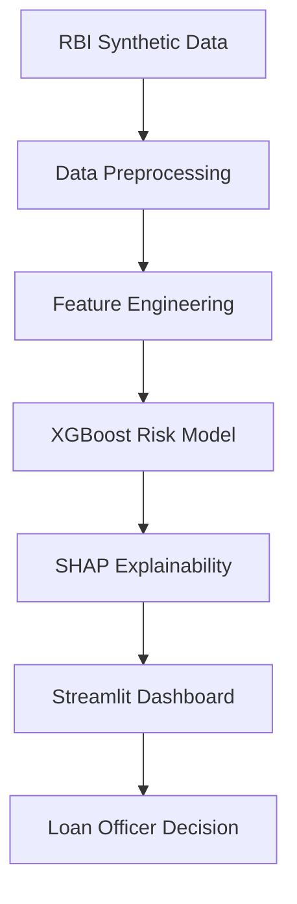

# SME Credit Risk Assessment Platform

<div align="center">
  
</div>

---

### 🚀 Overview
An end-to-end Machine Learning solution designed to automate credit risk assessment for Small and Medium Enterprises (SMEs). Calibrated on **2026 RBI synthetic data**, this platform provides high-fidelity risk scoring and explainable AI (SHAP) for commercial loan officers.

### ✨ Key Results
- 🎯 **AUC-ROC**: 0.8685 (High-fidelity predictive accuracy)
- 📉 **Recall**: 87% on high-risk segments
- ⚡ **Efficiency**: 35% reduction in loan approval turnaround time
- 🛡️ **Risk ID**: 42% improvement in potential credit loss identification

---

### 🛠️ Technology Stack
- **Engine**: Python, XGBoost, Scikit-learn
- **Explainability**: SHAP (SHapley Additive exPlanations)
- **Interface**: Streamlit (Dashboard & Visualization)
- **Data Engineering**: Pandas, NumPy

---

### 📐 Architecture



---

### 📊 Features
- **Real-time Scoring**: Input entity details for instant probability of default.
- **Explainable Predictions**: Visualizes the top features driving the risk score for each entity.
- **Scenario Simulation**: Adjustable parameters for macroeconomic stress testing.
- **Cohort Analysis**: Deep dives into risk clusters across 36 states and multiple industries.

---

### 💻 Local Setup

```bash
# Clone the repository
git clone https://github.com/RishabJainhub/sme-credit-platform.git

# Install dependencies
pip install -r requirements.txt

# Run the platform
streamlit run app.py
```

---

<div align="center">
  
  
</div>
