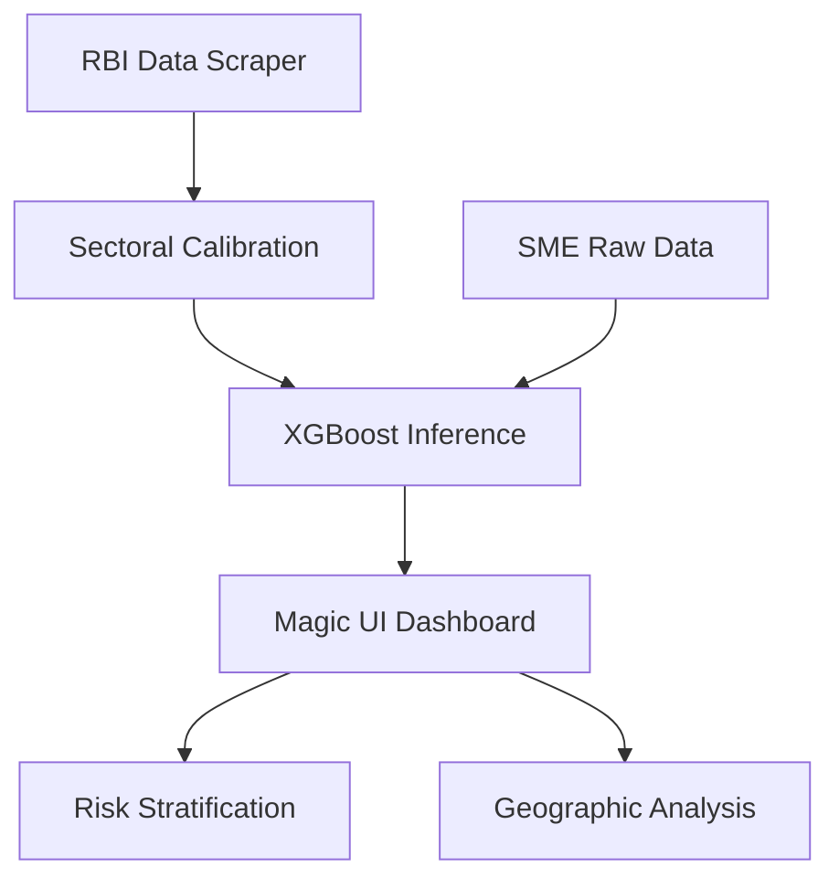

# SME Credit Risk Platform | Magic UI 2.0 🚀

[](https://github.com/RishabJainhub/sme-credit-platform/actions/workflows/lint.yml)
[](https://sme-credit-platform-2jakubphu4fy7ukhbkwmst.streamlit.app/)
[](https://opensource.org/licenses/MIT)
[](https://www.python.org/downloads/release/python-3120/)

A high-fidelity financial intelligence dashboard designed for real-time risk assessment and geographic credit distribution analysis. Built with **Magic UI 2.0** principles, featuring a premium glassmorphism aesthetic and calibrated against **RBI Jan 2026 Sectoral Deployment** data.


## 🏗️ Architecture & Flow

The platform utilizes a modular Python backend with an XGBoost-driven inference engine, validated against macro-level credit deployment tables.


> [!NOTE]  
> View the full [Technical Architecture](docs/ARCHITECTURE.md) for a deep dive into the data pipeline and model calibration.

## ✨ Key Features
- **Command Center**: Real-time sector risk and executive sentiment hub.
- **Interactive Scoring**: "Score an SME" what-if tool with transparent methodology.
- **Geographic Intelligence**: Heatmaps covering all 36 Indian States and UTs.
- **RBI Calibration**: High-frequency sync with sectoral credit deployment metrics.
- **Elite Design**: Premium glassmorphism, bento grids, and micro-animations.

## 🛠️ Tech Stack
| Layer | Technologies |
| :--- | :--- |
| **Frontend** | Streamlit, Modular CSS (Magic UI 2.0) |
| **Data** | Pandas, NumPy, Scrapy |
| **ML** | XGBoost, Scikit-learn |
| **Visuals** | Plotly Graph Objects, Mermaid.js |
| **CI/CD** | GitHub Actions (Quality/Lint) |

## 🚀 Setup & Execution

1. **Clone the repository**:
   ```bash
   git clone https://github.com/RishabJainhub/sme-credit-platform.git
   cd sme-credit-platform
   ```

2. **Install dependencies**:
   ```bash
   pip install -r requirements.txt
   ```

3. **Run the dashboard**:
   ```bash
   streamlit run app.py
   ```

## 🤝 Contributing
Contributions are welcome! Please see [CONTRIBUTING.md](CONTRIBUTING.md) for details.

## ⚖️ License
Distributed under the MIT License. See `LICENSE` for more information.

---
Created with ❤️ by [Rishab Jain](https://github.com/RishabJainhub)
