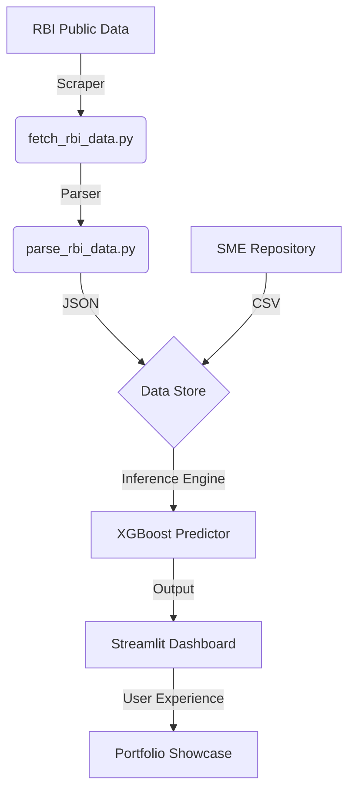

# Platform Architecture 🏛️

## System Overview
The SME Credit Risk Platform is a full-stack financial intelligence dashboard designed to provide real-time risk assessment and geographic credit distribution analysis. It leverages a modern data stack to process over 5,000 SME records with high-frequency calibration against RBI sectoral deployment data.

## Tech Stack
- **Frontend**: Streamlit (Magic UI 2.0 Design System)
- **Styling**: Modular CSS (`assets/styles.py`) for premium glassmorphism
- **Data Engine**: Pandas, NumPy
- **ML Inference**: XGBoost, Scikit-learn
- **Visualization**: Plotly Graph Objects (SUI & Magic UI themed)
- **Data Sync**: Custom RBI Scrapers (`fetch_rbi_data.py`)

## Directory Structure
```text
sme-credit-platform/
├── .github/ workflows/     # CI/CD (Linting)
├── assets/                 # Modular Design System (CSS)
├── data/                   # SME & RBI Datasets
├── docs/                   # Technical Documentation
├── notebooks/              # Research & EDA
├── app.py                  # Main Application logic
└── requirements.txt        # Production Dependencies
```

## Data Flow


## Design Philosophy
The platform adheres to **Magic UI 2.0** and **SUI** principles:
1. **Glassmorphism**: Subtle blurs and translucent layers for a modern fintech aesthetic.
2. **Bento Grids**: Non-linear, organized layouts for density and readability.
3. **Micro-interactions**: Hover states and shimmer effects to increase user engagement.
4. **Data Transparency**: Live RBI calibration badges to bridge the gap between simulation and reality.
